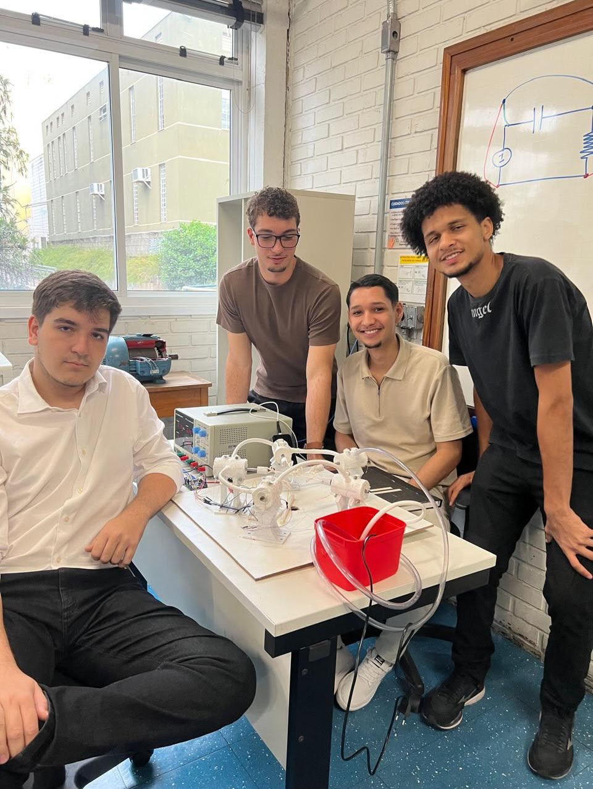

# Motor elétrico radial de cinco fases com controle remoto

Protótipo acadêmico de um motor elétrico radial construído com cinco bobinas e controle por uma placa baseada em ESP32. O projeto combina fabricação mecânica, acionamento eletromagnético, sequenciamento de fases e um comando remoto simples consultado pela internet.

<p align="center">
  
</p>

## Visão geral

O rotor é movimentado pela ativação sucessiva das cinco bobinas. O firmware oferece dois mapas de ligação (`MODO 1` e `MODO 2`) e percorre as posições pelo salto matemático `k = 2` em um conjunto de `n = 5`, formando a ordem radial em estrela. O intervalo entre ativações diminui exponencialmente, produzindo uma rampa de aceleração.

Uma tarefa separada do ESP32 consulta, a cada 10 segundos, o arquivo público [`commands.txt`](commands.txt). Os valores aceitos são:

- `MOTOR_ON`: inicia o sequenciamento e zera o cronômetro de aceleração;
- `MOTOR_OFF`: desliga todas as saídas das bobinas.

## Principais recursos

- controle de cinco bobinas por GPIO;
- teste automático individual das bobinas na inicialização;
- dois mapas de pinagem selecionáveis em compilação;
- sequência radial calculada por aritmética modular;
- aceleração com redução exponencial do intervalo entre passos;
- comando remoto por Wi-Fi e arquivo hospedado no GitHub;
- execução da comunicação em uma tarefa separada do sequenciamento.

## Estrutura do repositório

```text
.
|-- cad/
|   `-- README.md
|-- docs/
|   `-- README.md
|-- firmware/
|   `-- MotorRadial/
|       |-- MotorRadial.ino
|       |-- arduino_secrets.example.h
|       |-- sequenciamento.ino
|       |-- sketch.json
|       |-- variaveis.h
|       `-- wifi.ino
|-- hardware/
|   `-- README.md
|-- media/
|   |-- apresentacao-01.jpeg
|   |-- apresentacao-02.jpeg
|   |-- apresentacao-03.jpeg
|   |-- apresentacao-04.jpeg
|   |-- demonstracao-01.mp4
|   |-- demonstracao-02.mp4
|   |-- demonstracao-03.mp4
|   |-- demonstracao-04.mp4
|   `-- README.md
|-- .gitignore
|-- commands.txt
`-- README.md
```

## Firmware

### Preparar as credenciais

Copie `firmware/MotorRadial/arduino_secrets.example.h` para `firmware/MotorRadial/arduino_secrets.h` e preencha a cópia local:

```cpp
#define SECRET_SSID "NOME_DA_REDE"
#define SECRET_PASSWORD "SENHA_DA_REDE"
```

O arquivo real de credenciais é ignorado pelo Git e não deve ser publicado.

O ZIP público do sketch original continha credenciais diretamente no código. Se aquela senha ainda estiver em uso, altere-a antes de voltar a conectar o protótipo.

### Compilar com Arduino CLI

```bash
arduino-cli core install esp32:esp32
arduino-cli compile --fqbn esp32:esp32:esp32 firmware/MotorRadial
```

A compilação usa `ESP32 Dev Module` como alvo de referência porque o sketch emprega números de GPIO brutos, Wi-Fi e recursos FreeRTOS específicos do ESP32. Confirme o modelo exato da placa física antes de gravar.

Validação realizada com Arduino CLI 1.5.1 e o núcleo oficial Espressif `esp32:esp32` 3.3.11:

- modo 1: 1.022.916 bytes de programa (78%) e 48.504 bytes de memória global (14%);
- modo 2: 1.022.920 bytes de programa (78%) e 48.504 bytes de memória global (14%).

## Sequenciamento

No modo padrão, o atraso entre passos começa em 800 ms e tende a 100 ms, com constante de decaimento de 40 s. O firmware imprime uma RPM estimada com base em uma relação assumida entre passos e revolução; esse valor ainda não foi validado com tacômetro.

Consulte [hardware/README.md](hardware/README.md) antes de energizar o protótipo.

## Atenção antes do primeiro teste

- as bobinas exigem estágio de potência e fonte externa adequada;
- a pinagem física ainda precisa ser confrontada com o protótipo e o Tinkercad;
- o teste de bobinas é executado automaticamente durante a inicialização;
- a função de conexão Wi-Fi aguarda indefinidamente até a rede ficar disponível;
- o comando remoto atual é público e não possui autenticação própria;
- a RPM mostrada no monitor serial é uma estimativa, não uma medição;
- tensão, corrente, aquecimento e velocidade máxima segura ainda precisam ser medidos.

Faça os primeiros testes com alimentação limitada, uma bobina por vez e possibilidade de desligamento imediato.

## Materiais do projeto

- [Sketch no Arduino Cloud](https://app.arduino.cc/sketches/5fc2e5a7-c3c3-415b-b562-e2339e4dc90b?view-mode=preview)
- [Circuito no Tinkercad](https://www.tinkercad.com/things/hriccYSg3r2-dazzling-gaaris-fulffy/editel?sharecode=ODh7P4tV9Ig7Nv-Jada4wmx27EI8rfMsCgkdmTvJzwE)
- [Documentação disponível e pendências](docs/README.md)
- [Modelo CAD e pendências](cad/README.md)
- [Fotos, vídeos e identificação do material](media/README.md)

## Autoria e contexto acadêmico

O protótipo foi desenvolvido por Arthur Artiaga Oliveira e um colega durante o primeiro semestre de Engenharia Elétrica, como atividade prática de aprendizagem interdisciplinar. O nome do segundo integrante, a instituição, a disciplina, o professor e o ano da apresentação serão acrescentados quando forem confirmados pelo artigo ou pela equipe.

## English summary

This repository documents a custom five-phase radial electric motor controlled by an ESP32-class board. Five coils are driven in a star-like modular sequence, with an exponential acceleration ramp and a simple GitHub-hosted remote command. The repository includes sanitized firmware and structured placeholders for the circuit, CAD model, academic report, photos and test videos.

## Licença

Uma licença de reutilização ainda não foi definida. Até que os autores escolham uma licença, o conteúdo permanece protegido pelos direitos de seus respectivos autores.
